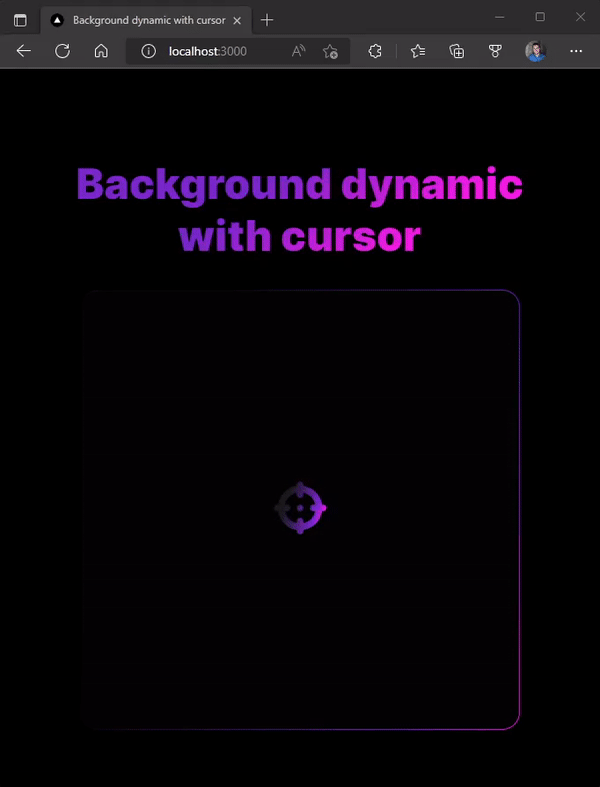

## 💻 About Project

This project demonstrates some effects dynamically applied to the background according to the mouse pointer position.

## 🔖 Preview



## 🚀 Getting Started

First, run the development server:
```bash
npm install
# or
yarn install
```

Second, run the development server:
```bash
npm run dev
# or
yarn dev
```
Third, Open [http://localhost:3000](http://localhost:3000) with your browser to see the result.